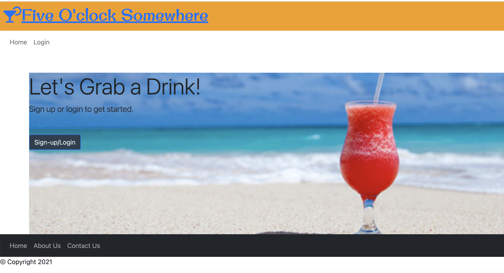
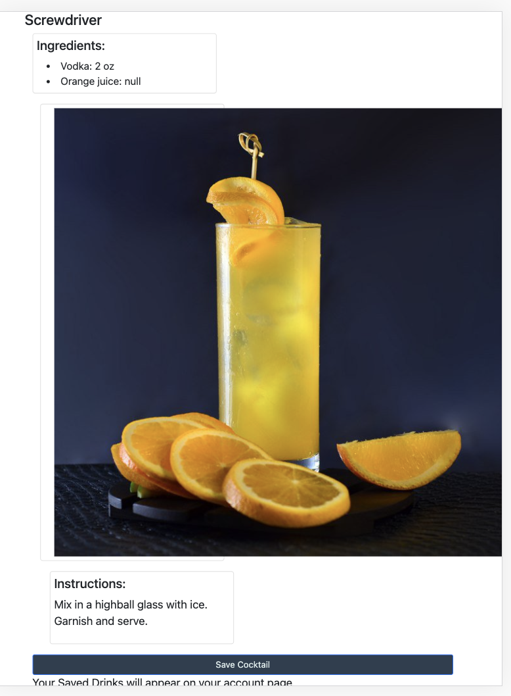

# 5-O-Clock-Drink-Generator

## Table of Contents

1. [Title](#title)
2. [Description](#Description)
3. [Installation](#Installation)
4. [Technologies](#Technologies)
5. [Contributors](#Contributors)
6. [Steps](#Steps)
7. [Screenshot](#Screenshot)

# Description

- A website where a user can find a drink based off the drinks name, ingredients in the drink, or whether or not the drink is alcoholic and save that drink to their profile for later use.

# Installation

- To install: npm start

## Links

- Github:https://github.com/kwing25/5-0-Clock-Drink-Generator
- Heroku:

-

# Technologies

- The site uses Javascript, Node,js, Inquirer, Express, MYSQL, Sequelize, Bcrypt
- [Cocktail API](https://www.thecocktaildb.com/api.php?ref=apilist.fun)

# Contributors

Janee Artis, Melanie Elson, Jake Studer, Kendra Wing

# Steps

- User is presented with website and must log in or sign up in order to view or search for drinks
- Once logged in user has the choice to click on cocktail for the day, favorites or search for their own.
- When user searches for cocktail they are presented with a list of drinks.
- When user selects cocktail they are presented with a thumbnail image, ingredients and instructions.
- When the user clicks on My Account they are presented with a note feature where they can input text, save, update or delete notes.
- User is also presented with a list of saved drinks.

### 5-O'Clock Screenshot

